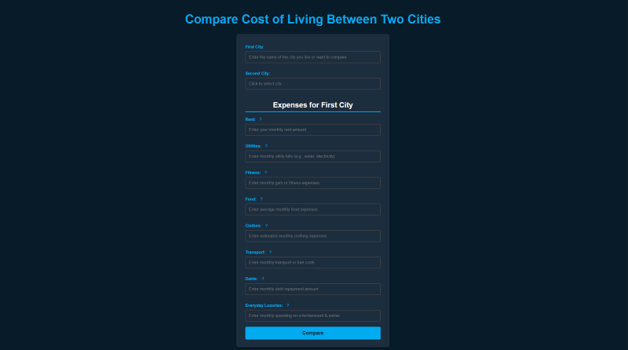
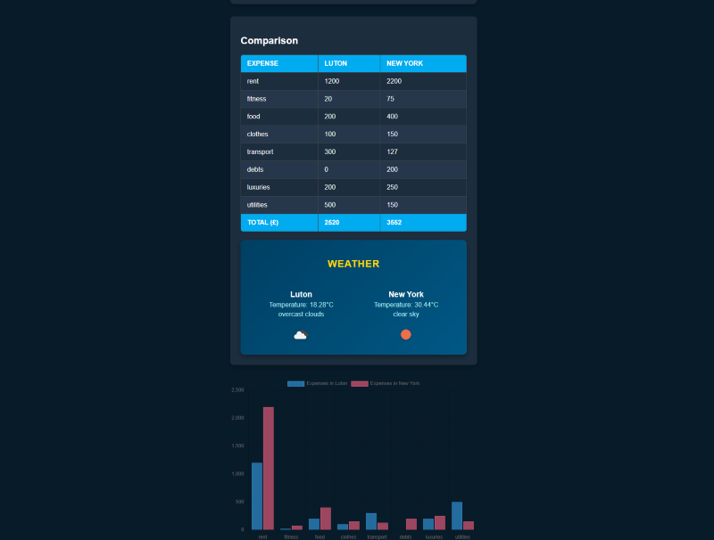
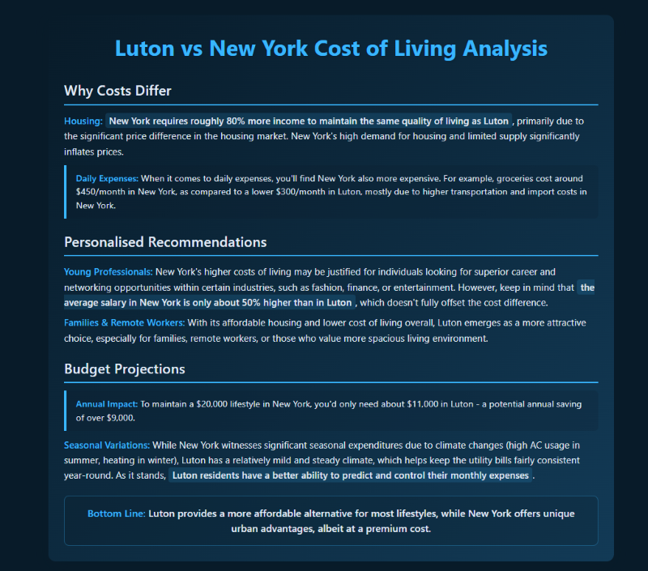

# 🌍 Cost of Living Comparison

**Cost of Living Comparison** is a web-based application that helps users evaluate and compare living expenses between two cities. Whether you're planning a move, budgeting for travel, or simply curious, this tool offers an intuitive way to make informed, data-driven financial decisions.

---

## ✨ Key Features

* 💰 **Custom Expense Input** – Enter your personal expenses (e.g., rent, groceries, transport) for a selected city.
* 🔁 **City-to-City Comparison** – Compare your expenses against average costs in another city.
* 📊 **Visual Cost Breakdown** – Get a clear, visual summary of cost differences.
* 📈 **Analysis Summary** - Get details on why costs differ, offers personalised recommendations for different groups and includes budget projections.
* 🧠 **Smarter Decisions** – Use data insights to guide relocation, job changes, or budgeting.

---

## 🛠️ Tech Stack

* **Frontend**: HTML, CSS, JavaScript
* **Backend**: Python (Flask)
* **API Integration**: OpenWeatherMap (for city-based weather context), OpenAI (for fetching city averages)

## 🛜 Website 
Here's the [link](https://cost-of-living-project-2.vercel.app) to access the app

## 🚀 How It Works

1. **Enter Your Expenses** – Provide your monthly costs for your current city.
2. **Choose a Comparison City** – Select another city to compare against.
3. **Analyse the Difference** – The app fetches average living cost data and calculates the variance.
4. **View Results** – Explore an intuitive breakdown of cost categories to understand key differences.

---

## 🎥 Usage Guidelines 
This [video](https://www.loom.com/share/499ca821147d4e88933e0a35fb889d01) will show you how to navigate through the app.

---

## 📃 Form 

This form is designed for users to input expenses for a "First City".The form includes fields for selecting two cities and detailing various monthly costs, such as rent, utilities, food, and transportation, culminating in a "Compare" button.

## 💸 Results 

This is the results section, where it presents a "Comparison" interface detailing the cost of living between 2 cities through three sections. An expense table breaks down monthly costs for various categories in both cities, showing the total expenses of the first city and the second city. Additionally, the display includes a weather comparison with current temperatures and conditions, as well as a bar chart visually representing the expense differences between the two cities.

## 📊 Analysis 

This is the analysis section, detailing why costs differ, offering personalised recommendations, and providing budget projections. For example, the analysis highlights that New York is significantly more expensive for housing and daily expenses compared to Luton. Ultimately, the report concludes that Luton offers a more affordable lifestyle, while New York provides urban advantages at a premium cost.

## 🧪 Installation & Setup

## Prerequisites
- Python 3.7+
- Git
- OpenWeatherMap API key (free at [openweathermap.org](https://openweathermap.org/api))
- OpenAI API Key (free at [OpenAI](https://openai.com/api/))

## Quick Setup

1. **Clone the repository**
   ```bash
   git clone https://github.com/HakimM16/Cost-of-living-project-2.git
   cd Cost-of-living-project-2
   ```

2. **Create and activate virtual environment**
   ```bash
   python -m venv venv
   source venv/bin/activate  # On Windows: venv\Scripts\activate
   ```

3. **Install dependencies**
   ```bash
   pip install -r requirements.txt
   ```

4. **Set up environment variables**
   Create a `.env` file in the project root:
   ```env
   OPENWEATHER_API_KEY=your_api_key_here
   OPENAI_API_KEY=your_api_key_here
   ```

5. **Run the application**
   ```bash
   flask run
   ```

6. **Open in browser**
   Navigate to `http://127.0.0.1:5000`

## Troubleshooting

- **Port 5000 in use**: Run with `flask run --port 5001`
- **Module not found**: Ensure virtual environment is activated
- **API issues**: Verify your OpenWeatherMap API key and OpenAI API key are active

---

## 📌 Notes

* API keys for OpenWeatherMap and OpenAI is required (add it to your environment or config file).
* Default average cost data may be mocked or simplified — real-time integration is planned for future releases.

---